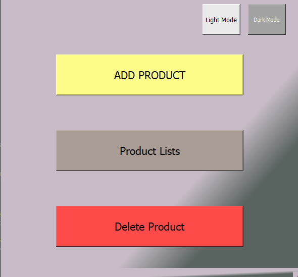
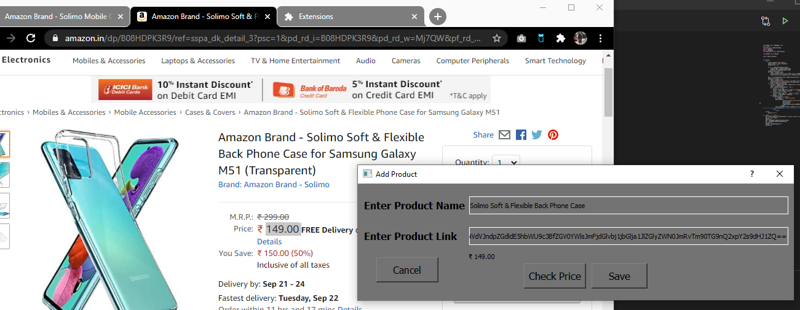
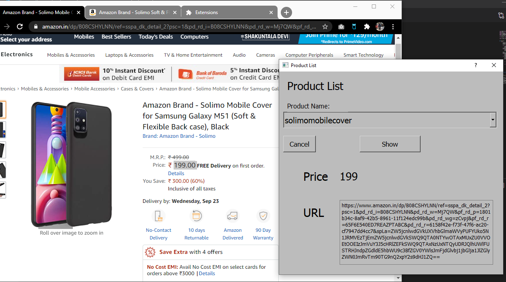
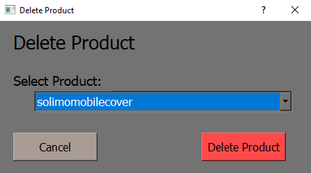

# WatchMen
<li>To run install requirements using:  
&ensp;&ensp;&ensp;&ensp;&ensp;&ensp;&ensp;&ensp;pip install -r requirements.txt
<li>Make sure you have sql server in your pc to run this program since this program uses SQL database
<li>Products from amazon.in and flipkart.com can only be added. Adding products from another sites may cause error in program
<h4> Screenshots </h4>
<ol>
<li> App in dark mode</li>
</img>
<li> App in light mode </li>
</img>
<li> Notification </li>
</img>
<li> Add Product </li>
</img>
<li> Product List </li>
</img>
<li> Delete Product </li>
</img>
</ol>
